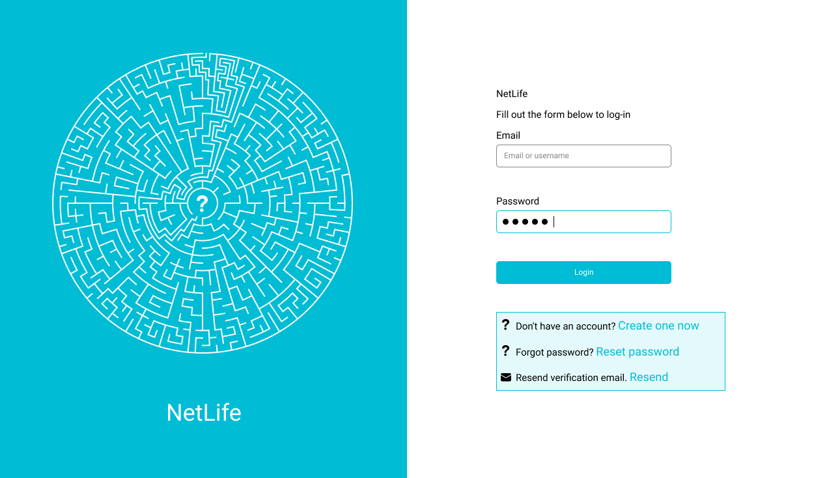
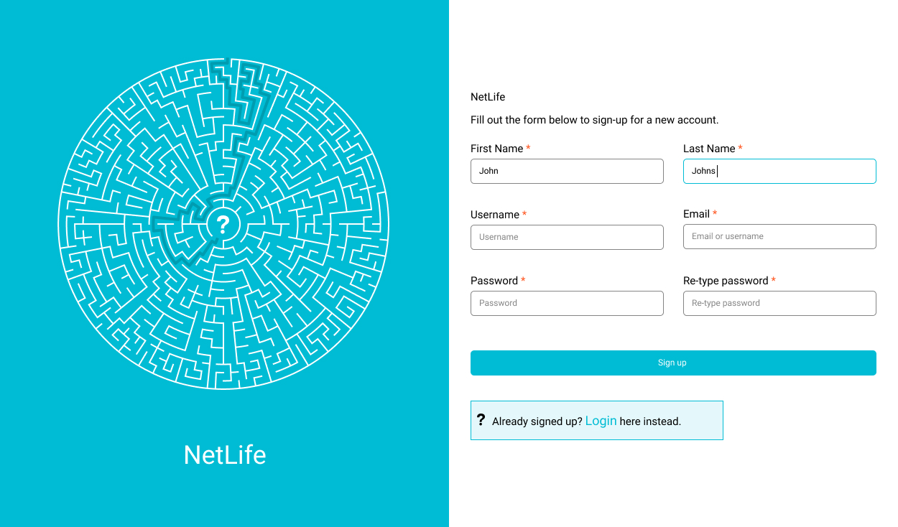
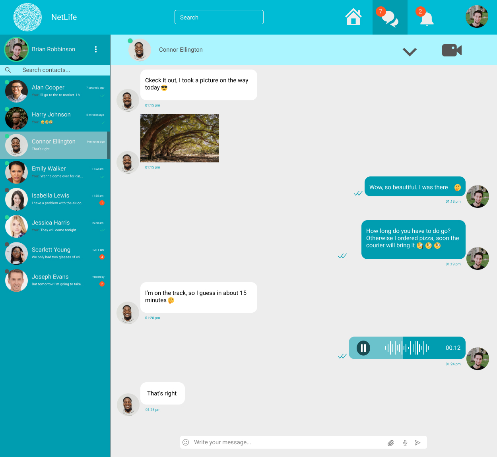

# Social network app 'NetLife'

[You can see screenshots of the 'NetLife' below](#screenshots)

## Install

1. `npm install` или `yarn install`
2. Check the versions of the dependencies that are in the github with those that are installed. Pay special attention to socket.io-client, must be version 2.2.0
3. Create variables.env file and replace values with yours:

```
NODE_ENV=development
DATABASE=mongodb://localhost:27017/social-network-netlife
JWT_KEY=E50D165D5B8462311261E3002E9AAAFCE03D490973477B045556D83148FE52EA
EMAILUSER="nikita@gmail.com"
EMAILPASS="123"
HOST=http://localhost:3000/
ENABLE_SEND_EMAIL="true or false" // false if you don't want to set it up
TEST_DATABASE="social_network_test"
```

4. Install MongoDB and start it.
5. Being in the server folder run the command `npm dev` or `yarn dev`.

## Built With

### Frontend

- ReactJS + hooks
- Redux
- ReduxThunk
- PropTypes
- Axios
- Mapbox-gl
- Semantic Ui React
- Emoji Mart
- Socket.io
- history

### Backend

- NodeJS / Express
- MongoDB / Mongoose
- BcryptJS
- JsonWebToken
- Socket.io
- Multer
- Nodemailer
- LinkifyJS

## Features

- Like posts, comments, replies
- See likes for posts, comments, replies
- Follow, unfollow
- Update user information
- Search users
- Tag people on post and in comments with autocomplete
- Send verification email
- Pagination for home feed, user profile, hashtag page, location page, notifications, comments, replies

### Realtime

- Get notification when someone likes your post, comment, reply, tag you on post or reply on comment
- Chat send text message, image
- Seen feature and activity status of user

## <a name="screenshots">Screenshots</a>

<div align="center" >
  <h3>Sign in</h3>
  

  <h3>Sign up</h3>
  

  <h3>Home</h3>
  

  <h3>Owner profile</h3>
  

  <h3>User profile</h3>
  

  <h3>Chat</h3>
  
</div>
